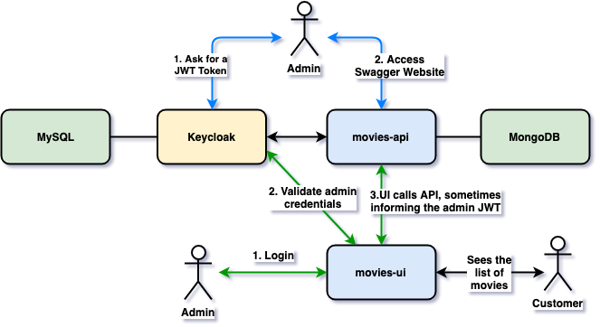
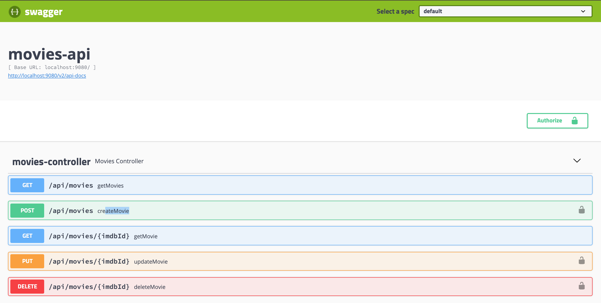

# `springboot-react-keycloak`

The goal of this project is to secure `movies-app`, using [`Keycloak`](https://www.keycloak.org/). `movies-app` consists of two applications: one is a [Spring Boot](https://docs.spring.io/spring-boot/docs/current/reference/htmlsingle/) Rest API called `movies-api` and another is a [ReactJS](https://reactjs.org/) application called `movies-ui`.

## Project diagram



## Applications

### movies-api

[`Spring Boot`] Web Java backend application that exposes a Rest API to manage **movies**. Its sensitive endpoints - like create, update and delete movies - can just be just accessed if an access token (JWT) issued by `Keycloak` is provided. `movies-api` stores its data in a [`Mongo`](https://www.mongodb.com/) database.

### movies-ui

`ReactJS` frontend application where `users` can see the list of movies and `admins` can manage movies. In order to access the `Admin` section, the `admin` should login using his/her username and password. Those credentials are handled by `Keycloak`. All the requests coming from `movies-ui` to sensitive endpoints in `movies-api` have the access token (JWT) that is generated when the `admin` logs in. `movies-ui` uses [`Semantic UI React`](https://react.semantic-ui.com/) as CSS-styled framework.

## Prerequisites

### jq

In order to run some commands/scripts, you must have [`jq`](https://stedolan.github.io/jq) installed on you machine

### OMDb API

To use the `Wizard` option to search and add a movie, you need to get an API KEY from [OMDb API](https://www.omdbapi.com/). In order to do it, access https://www.omdbapi.com/apikey.aspx and follow the steps provided by the website.

Once you have the API KEY, create a file called `.env.local` with the following content in `springboot-react-keycloak/movies-ui` folder
```
REACT_APP_OMDB_API_KEY=<your-api-key>
```

## Start environment

In a terminal and inside `springboot-react-keycloak` root folder run
```
docker-compose up -d
```

Wait a little bit until all containers are Up (healthy). You can check their status running
```
docker-compose ps
```

## Configure Keycloak

In a terminal and inside `springboot-react-keycloak` root folder, run the following script to configure `movies-app` in Keycloak
```
./init-keycloak.sh
```

At the end of the script, it will be printed the secret that Keycloak generates for `movies-app`
```
MOVIESAPP_CLIENT_SECRET=...
```

Copy the secret value and paste it in `credentials.secret` property present in `springboot-react-keycloak/movies-ui/public/keycloak.json` file.

## Running movies-app using Maven & Npm

### movies-api

In a terminal and inside `springboot-react-keycloak/movies-api`, run the following Maven command
```
./mvnw clean spring-boot:run -Dspring-boot.run.jvmArguments="-Dserver.port=9080"
```

### movies-ui

Open another terminal and go to `springboot-react-keycloak/movies-ui` folder

Execute the command below if you are running `movies-ui` for the first time
```
npm install
```

Then, to start `movies-ui` run
```
npm start
```

## Applications URLs

| Application | URL                                   | Credentials       |
| ----------- | ------------------------------------- | ----------------- |
| movie-api   | http://localhost:9080/swagger-ui.html | [Access Token](https://github.com/ivangfr/springboot-react-keycloak#using-movies-api-with-swagger) |
| movie-ui    | http://localhost:3000                 | ivan.franchin/123 |
| Keycloak    | http://localhost:8080/auth/admin/     | admin/admin       |

## Demo

The gif below shows an admin adding two movies using the wizard option. First, he looks for the movie `American Pie`. The search is looking for data at [OMDb API](https://www.omdbapi.com/). Then, he selects the movie in the table. The information on the form is already fulfilled based on the response from OMDb API. The preview of the movie card, as the customer will see it, is displayed. Finally, the button `Create` is pressed and the movie is created. After that, the movie `Resident Evil` is created.


## Getting Access Token

You can manage movies accessing directly `movies-api` endpoints using the Swagger website or `curl`. However, for the sensitive endpoints like `POST /api/movies`, `PUT /api/movies/{id}` and `DELETE /api/movies/{id}`, you need to inform an access token issued by `Keycloak`. Below are the steps to get the token.

- Open a terminal

- Export the `movie-app` client secret (generated on [Configure Keycloak](https://github.com/ivangfr/springboot-react-keycloak#configure-keycloak)) to the environment variable `MOVIESAPP_CLIENT_SECRET`
```
MOVIESAPP_CLIENT_SECRET=...
```

- Run the following commands to get the access token
```
ACCESS_TOKEN="$(curl -s -X POST \
  "http://localhost:8080/auth/realms/company-services/protocol/openid-connect/token" \
  -H "Content-Type: application/x-www-form-urlencoded" \
  -d "username=ivan.franchin" \
  -d "password=123" \
  -d "grant_type=password" \
  -d "client_secret=$MOVIESAPP_CLIENT_SECRET" \
  -d "client_id=movies-app" | jq -r .access_token)"
```

### Calling movies-api endpoints using curl

#### Trying to add a movie without access token
```
curl -i -X POST "http://localhost:9080/api/movies" \
  -H "Content-Type: application/json" \
  -d '{ "imdbId": "tt5580036", "title": "I, Tonya", "director": "Craig Gillespie", "year": 2017, "poster": "https://m.media-amazon.com/images/M/MV5BMjI5MDY1NjYzMl5BMl5BanBnXkFtZTgwNjIzNDAxNDM@._V1_SX300.jpg"}'
```

It will return
```
HTTP/1.1 302
```
> Here, the application is trying to redirect the request to an authentication link.

#### Trying again to add a movie, now with access token
```
curl -i -X POST "http://localhost:9080/api/movies" \
  -H "Authorization: Bearer $ACCESS_TOKEN" \
  -H "Content-Type: application/json" \
  -d '{ "imdbId": "tt5580036", "title": "I, Tonya", "director": "Craig Gillespie", "year": 2017, "poster": "https://m.media-amazon.com/images/M/MV5BMjI5MDY1NjYzMl5BMl5BanBnXkFtZTgwNjIzNDAxNDM@._V1_SX300.jpg"}'
```

It will return
```
HTTP/1.1 201
{
  "imdbId": "tt5580036",
  "title": "I, Tonya",
  "director": "Craig Gillespie",
  "year": "2017",
  "poster": "https://m.media-amazon.com/images/M/MV5BMjI5MDY1NjYzMl5BMl5BanBnXkFtZTgwNjIzNDAxNDM@._V1_SX300.jpg"
}
```

#### Getting the list of movies. This endpoint does not requires access token
```
curl -i http://localhost:9080/api/movies
```

It will return
```
HTTP/1.1 200
[
  {
    "imdbId": "tt5580036",
    "title": "I, Tonya",
    "director": "Craig Gillespie",
    "year": "2017",
    "poster": "https://m.media-amazon.com/images/M/MV5BMjI5MDY1NjYzMl5BMl5BanBnXkFtZTgwNjIzNDAxNDM@._V1_SX300.jpg"
  }
]
```

### Using movies-api with Swagger



- Access `movies-api` Swagger website, http://localhost:9080/swagger-ui.html

- Click on `Authorize` button. Paste the [`access token`](https://github.com/ivangfr/springboot-react-keycloak#getting-access-token) in the `Value` field prefixed by `Bearer`, like `Bearer <access-token>`. Then, click on `Authorize` and on `Close` to finalize.

- Done! You can now access the sensitive endpoints.

## Shutdown

Go to `movies-api` and `movies-ui` terminals and press `ctrl-c` on each one

Then, to stop and remove containers, networks and volumes, run
```
docker-compose down -v
```

## How to upgrade movies-ui dependencies to latest version

In a terminal and inside `springboot-react-keycloak/movies-ui` folder, run the following commands
```
npm i -g npm-check-updates
ncu -u
npm install
```

## TODO

- add confirmation dialog before deleting a movie
